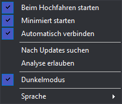
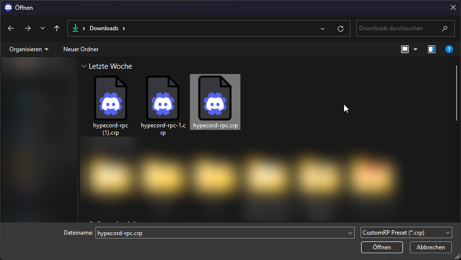

Credit to [@maximmax4](https://github.com/maximmax42/Discord-CustomRP)

# Schritt 1
Lade CustomRP.1.17.5.exe [hier](https://github.com/maximmax42/Discord-CustomRP/releases/download/1.17.5/CustomRP.1.17.5.exe) herunter

# Schritt 2
Einstellungen übernehmen wie im Bild: 
</img>

# Schritt 3
[Klicke hier](https://raw.githubusercontent.com/hypecord-de/discord-rpc/main/config.crp) und drücke `STRG + S` um die Datei zu speichern.

# Schritt 4
Öffne das Programm und drücke `STRG + O`. Wähle jetzt die datei aus. (`config.crp`) 
</img>

# Schritt 5
- Schließe das Programm mit `ALT + F4`
- Es  bleibt in der Seitenleiste
